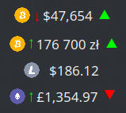
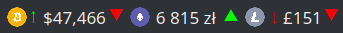
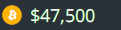

Crypto Tracker for KDE
======================
Plasma/KDE multi crypto currency price tracker widget, with support for multiple exchanges and currency pairs.

  

---

## Table of Contents ##

 * [Exchange ticker](docs/ticker.md)
 * [Configuration](docs/config.md)
 * [Installation](docs/install.md)
 * [Upgrading](docs/install.md#upgrading)
 * [Additional resources](#additional-resources)
 * [Changelog](CHANGES.md)
 * [License](#license)

---

## Additional resources ##

 * [Crypto Tracker widget in KDE store](https://store.kde.org/p/1481524/)
 * [Plasmoid developer helper tools](https://github.com/marcinorlowski/plasmoid-tools)
 * [Logo font: Evil Empire](https://www.dafont.com/evil-empire.font?text=Crypto+Tracker)
 * [Crypto Currency Logos](https://cryptologos.cc/)

---

## License ##

 * Written and copyrighted &copy;2021 by Marcin Orlowski <mail (#) marcinorlowski (.) com>
 * Weekday Grid widget is open-sourced software licensed under the [MIT license](http://opensource.org/licenses/MIT)

