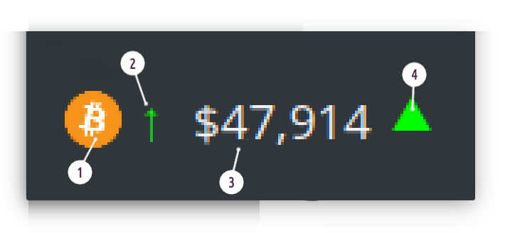

Crypto Tracker for KDE
======================
Plasma/KDE multi crypto currency price tracker widget, with support for multiple exchanges and currency pairs.

Currently setup up to 6 different cryptos to track, but this is pretty artificial limit and will be soon
lifted once I will have the time to rework configuration UI to properly handle unlimited number of entries
(which is already internally supported).

> Please note that current version may not support exchange or currency pair you like simply because
> I did not need them. As long as there's JSON ticker available for the given pair on exchange of your
> choice it can be easily added to the widget. Please [fill a new ticket](https://github.com/MarcinOrlowski/crypto-plasmoid/issues)
> for specific exchange, pair to be added.

## Ticker ##

Widget will display separate ticker for each configured exchange:

 1. Crypto icon (optional)
 1. Price trend (calculated in wider time window)
 1. Current exchange rate
 1. Exchange rate since last update (so this one may go up/down pretty often)

## Configuration ##

## Installation ##

You should be able to install HTML Clock widget either using built-in Plasma Add-on installer
or manually, by downloading `*.plasmoid` file either from project
[Github repository](https://github.com/MarcinOrlowski/crypto-plasmoid/) or
from [KDE Store](https://www.pling.com/p/1473016/)

### Using built-in installer ###

To install widget using Plasma built-in mechanism, press right mouse button over your desktop
or panel and select "Add Widgets..." from the context menu, then "Get new widgets..." eventually
choosing "Download New Plasma Widgets...". Then search for "HTML Clock" in "Plasma Add-On Installer" window.

### Manual installation ###

Download `*.plasmoid` file from [project Release section](https://github.com/MarcinOrlowski/crypto-plasmoid/releases).
Then you can either install it via Plasmashell's GUI, by clicking right mouse button over your desktop or panel and
selecting "Add widgets...", then "Get new widgets..." eventually choosing "Install from local file..." and pointing to downloaded
`*.plasmoid` file.

Alternatively you can install it using your terminal, with help of `kpackagetool5`:

    kpackagetool5 --install /PATH/TO/DOWNLOADED/htmlclock.plasmoid 

## Upgrading ##

If you already have widget running and there's newer release your want to install, use `kpackagetool5`
with `--upgrade` option. This will update current installation while keeping your settings intact:

    kpackagetool5 --upgrade /PATH/TO/DOWNLOADED/htmlclock.plasmoid

**NOTE:** Sometimes, due to Plasma internals, newly installed version may not be instantly seen working,
so you may want to convince Plasma by doing manual reload (this will **NOT** log you out nor affect
other apps):

    kquitapp5 plasmashell ; kstart5 plasmashell

---

## Additional resources ##

 * [Crypto Ticker widget in KDE store](https://www.pling.com/p/1473016/)
 * [Plasmoid developer helper tools](https://github.com/marcinorlowski/plasmoid-tools)
 * [Logo font: Evil Empire](https://www.dafont.com/evil-empire.font?text=Crypto+Tracker)

---

## License ##

 * Written and copyrighted &copy;2021 by Marcin Orlowski <mail (#) marcinorlowski (.) com>
 * Weekday Grid widget is open-sourced software licensed under the [MIT license](http://opensource.org/licenses/MIT)

