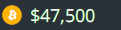

Crypto Tracker for KDE
======================
Plasma/KDE multi crypto currency price tracker widget, with support for multiple exchanges and currency pairs.

  

Currently setup up to 6 different cryptos to track, but this is pretty artificial limit and will be soon
lifted once I will have the time to rework configuration UI to properly handle unlimited number of entries
(which is already internally supported).

> Please note that current version may not support exchange or currency pair you like simply because
> I did not need them. As long as there's JSON ticker available for the given pair on exchange of your
> choice it can be easily added to the widget. Please [fill a new ticket](https://github.com/MarcinOrlowski/crypto-tracker-plasmoid/issues)
> for specific exchange, pair to be added.

---

## Table of Contents ##

 * [Exchange ticker](#ticker)
 * [Configuration](#configuration)
   * [Exchanges](#exchanges)
     * [Exchange](#exchange)
   * [Layout](#layout)
 * [Installation](#installation)
   * [Using built-in installer](#using-built-in-installer)
   * [Manual installation](#manual-installation)
 * [Upgrading](#upgrading)
 * [Additional resources](#additional-resources)
 * [Changelog](CHANGES.md)
 * [License](#license)

---

## Ticker ##

Widget will display separate ticker for each configured exchange:

 1. Crypto icon (optional)
 1. Price trend (calculated in wider time window)
 1. Current exchange rate
 1. Exchange rate since last update (so this one may go up/down pretty often)

---

## Configuration ##

### Exchanges ###
Here you can add, remove, edit and change order of your exchanges.

#### Exchange ####
The following settings are available for each exchange added to your ticker:

* **Enabled**: When checked, exchange will be shown on your widget.
* **Exchange**: Select exchange you want to use.
* **Update interval (minutes)**: Specify how often (in minutes) you want the exchange to be queried for new data.
* **Crypto**: Name of crypto currency you want to track on this exchange.
* **Hide currency icon**: If checked, no crypto icon will be drawn on ticker.
* **Fiat**: Select fiat currencty to show the price of selected crypto.
* **Hide decimals**: Check it, if you do not care about cents or fractional parts of selected fiat.
* **Show price change markers**: When enabled, you will be shown with visual markers indicating price change (up or down since last data pull).
* **Show trending markers**: When enabled, you will see price trending markers on your ticker.
* **Trending span (minutes)**: Trending marker is calculated using specified time span. I.e. if you set it to 60 minutes, then trending marker
  will show how much the current price differs vs price we seen 60 minutes ago.
* **Price raise marker color**: Specify color you want to use while drawing marker indicating price raise (default is green).
* **Price drop marker color**: Specify color you want to use while drawing marker indicating price drop (default is red).
* **Use custom locale**: When enabled you can specify locale name to be used to i.e. format prices. For example if your system default locale
  is `en_UK` (English, British) but you wan to see BTC price in PLN (polish zloty) then you way want to enable this option and set your
  locale to `pl` so the price is formatted using Polish currency formatting rules.
* **Flash on price raise**: When enabled, exchange entry background will flash using specified color (default green) when asset price went up since last check.
* **Flash on price drop**: When enabled, exchange entry background will flash using specified color (default red) when asset price dropped since last check.

### Layout ###
This pane controls how the widgets places exchange details in its internal layout grid.

* **Use custom grid layout**: By default Crypto Trackers puts all enabled exchanges either in single
  row (or single column) depending on your Panel orientation. This option lets you override this behavior
  and manually specify how many rows and columns your desired layout should be using.
* **Rows**: Number of rows you want the custom layout grid to use.
* **Columns**: Number of columns you want the custom layout grid to use.
* **Transparent background**: When checked, widget background be fully transparent, otherwise theme
  derrived background is used. **NOTE** this option is not available (hidden) if you use Plasma 5.19
  or newer, as it offers own, built-in mechanism to set plasmoid transparent background which is 
  preferred if available.

## Installation ##

You should be able to install HTML Clock widget either using built-in Plasma Add-on installer
or manually, by downloading `*.plasmoid` file either from project
[Github repository](https://github.com/MarcinOrlowski/crypto-tracker-plasmoid/) or
from [KDE Store](https://store.kde.org/p/1481524/)

### Using built-in installer ###

To install widget using Plasma built-in mechanism, press right mouse button over your desktop
or panel and select "Add Widgets..." from the context menu, then "Get new widgets..." eventually
choosing "Download New Plasma Widgets...". Then search for "HTML Clock" in "Plasma Add-On Installer" window.

### Manual installation ###

Download `*.plasmoid` file from [project Release section](https://github.com/MarcinOrlowski/crypto-tracker-plasmoid/releases).
Then you can either install it via Plasmashell's GUI, by clicking right mouse button over your desktop or panel and
selecting "Add widgets...", then "Get new widgets..." eventually choosing "Install from local file..." and pointing to downloaded
`*.plasmoid` file.

Alternatively you can install it using your terminal, with help of `kpackagetool5`:

    kpackagetool5 --install /PATH/TO/DOWNLOADED/htmlclock.plasmoid 

## Upgrading ##

If you already have widget running and there's newer release your want to install, use `kpackagetool5`
with `--upgrade` option. This will update current installation while keeping your settings intact:

    kpackagetool5 --upgrade /PATH/TO/DOWNLOADED/htmlclock.plasmoid

**NOTE:** Sometimes, due to Plasma internals, newly installed version may not be instantly seen working,
so you may want to convince Plasma by doing manual reload (this will **NOT** log you out nor affect
other apps):

    kquitapp5 plasmashell ; kstart5 plasmashell

---

## Additional resources ##

 * [Crypto Tracker widget in KDE store](https://store.kde.org/p/1481524/)
 * [Plasmoid developer helper tools](https://github.com/marcinorlowski/plasmoid-tools)
 * [Logo font: Evil Empire](https://www.dafont.com/evil-empire.font?text=Crypto+Tracker)

---

## License ##

 * Written and copyrighted &copy;2021 by Marcin Orlowski <mail (#) marcinorlowski (.) com>
 * Weekday Grid widget is open-sourced software licensed under the [MIT license](http://opensource.org/licenses/MIT)

