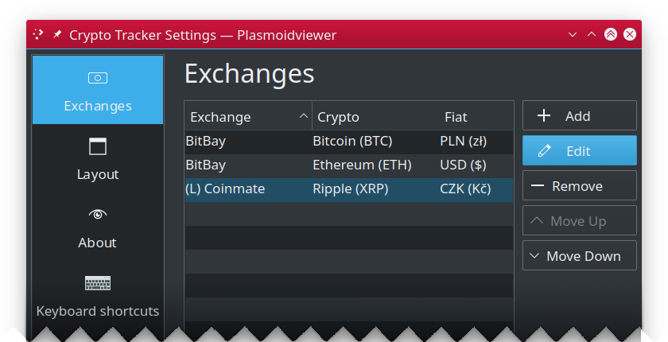
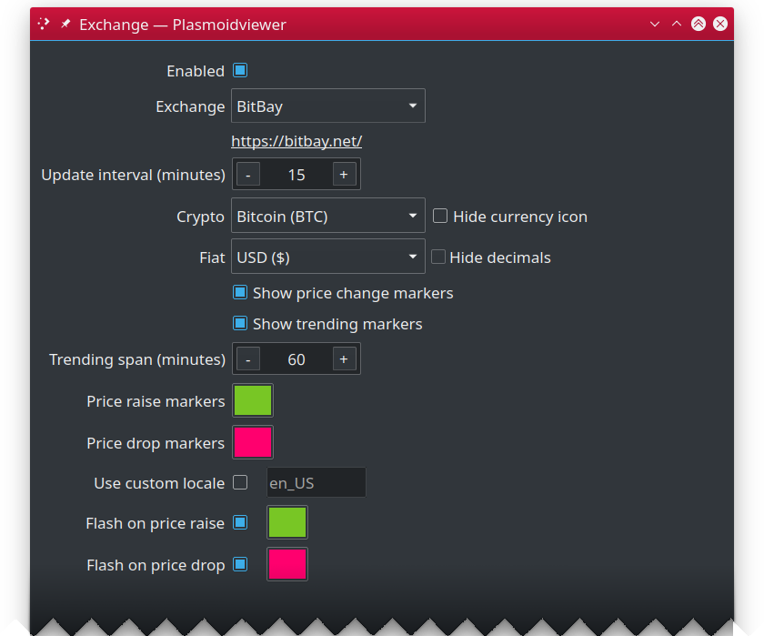
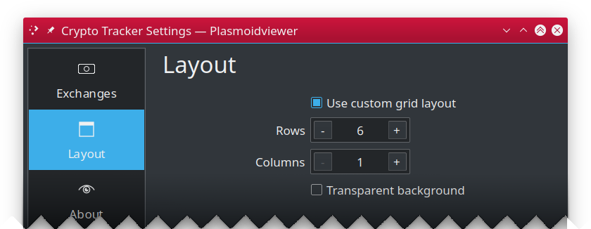

Crypto Tracker for Plasma 6
===========================
Plasma 6/KDE multi crypto currency price tracker widget, with support for multiple exchanges and currency pairs.

---

## Table of Contents ##

 * [Configuration](#configuration)
   * [Exchanges](#exchanges)
     * [Exchange](#exchange)
   * [Layout](#layout)

---

## Configuration ##

### Exchanges ###
Here you can add, remove, edit and change order of your exchanges.

* **Add**: Adds new exchange to your ticker.
* **Edit**: Edits selected exchange (you can also double click on the list).
* **Remove**: Removes selected exchange from your ticker.
* **Move up**: Reorders exchange list by moving select one up the list.
* **Move down**: Reorders exchange list by moving selected one down the list.

---

#### Exchange ####
The following settings are available for each exchange added to your ticker.

* **Enabled**: When checked, exchange will be shown on your widget.
* **Exchange**: Select exchange you want to use.
* **Update interval (minutes)**: Specify how often (in minutes) you want the exchange to be queried for new data.
* **Crypto**: Name of crypto currency you want to track on this exchange.
* **Hide currency icon**: If checked, no crypto icon will be drawn on ticker.
* **Fiat**: Select fiat currencty to show the price of selected crypto.
* **Hide decimals**: Check it, if you do not care about cents or fractional parts of selected fiat.
* **Show price change markers**: When enabled, you will be shown with visual markers indicating price change (up or down since last data pull).
* **Show trending markers**: When enabled, you will see price trending markers on your ticker.
* **Trending span (minutes)**: Trending marker is calculated using specified time span. I.e. if you set it to 60 minutes, then trending marker
  will show how much the current price differs vs price we seen 60 minutes ago.
* **Price raise marker color**: Specify color you want to use while drawing marker indicating price raise (default is green).
* **Price drop marker color**: Specify color you want to use while drawing marker indicating price drop (default is red).
* **Use custom locale**: When enabled you can specify locale name to be used to i.e. format prices. For example if your system default locale
  is `en_UK` (English, British) but you wan to see BTC price in PLN (polish zloty) then you way want to enable this option and set your
  locale to `pl` so the price is formatted using Polish currency formatting rules.
* **Flash on price raise**: When enabled, exchange entry background will flash using specified color (default green) when asset price went up since last check.
* **Flash on price drop**: When enabled, exchange entry background will flash using specified color (default red) when asset price dropped since last check.

---

### Layout ###
This pane controls how the widgets places exchange details in its internal layout grid.

* **Use custom grid layout**: By default Crypto Trackers puts all enabled exchanges either in single
  row (or single column) depending on your Panel orientation. This option lets you override this behavior
  and manually specify how many rows and columns your desired layout should be using.
* **Rows**: Number of rows you want the custom layout grid to use.
* **Columns**: Number of columns you want the custom layout grid to use.
* **Transparent background**: When checked, widget background be fully transparent, otherwise theme
  derived background is used. **NOTE** this option is not available (hidden) as Plasma 6 offers its
  own built-in mechanism to set plasmoid transparent background which is preferred.

